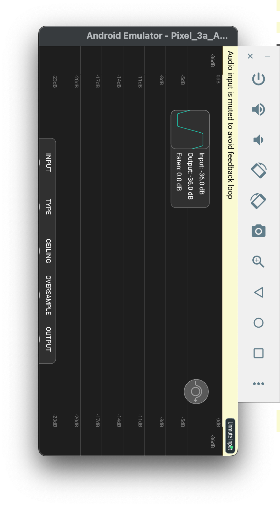
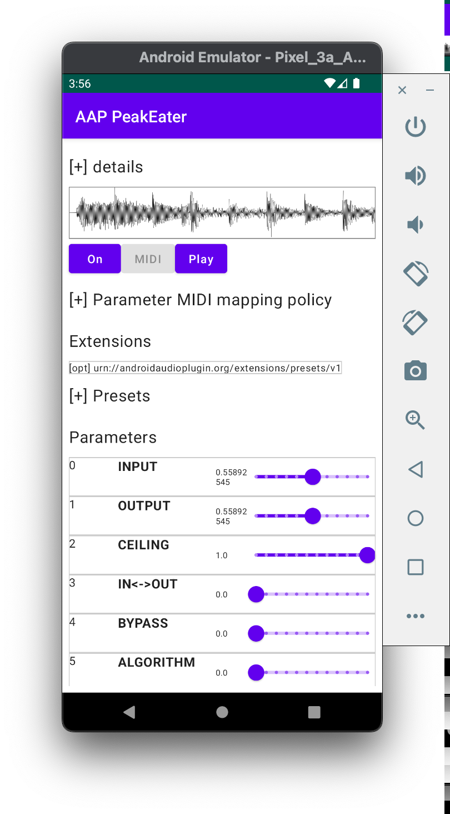
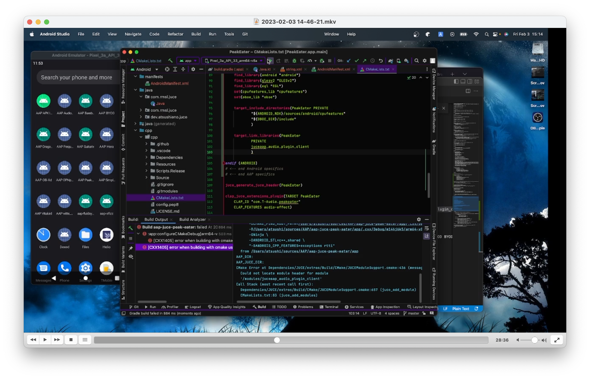

This is a port of [PeakEater](https://github.com/vvvar/PeakEater) to [aap-juce](https://github.com/atsushieno/aap-juce).

I created it to demonstrate how I manage to port a JUCE plugin to AAP ecosystem. Probabaly I should upload the screen recording but so far I have 1.2 GB of .mkv. and it is fullscreen.

## LICENSE

PeakEater is licensed under the GPLv3 license. aap-juce-peak-eater follows it and is licensed under the GPLv3 license likewise.
